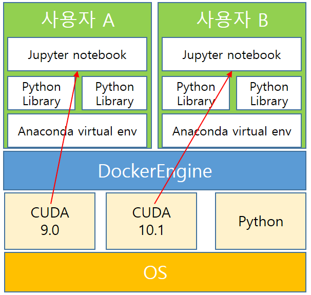

# The-fastest-joignable-Docker: 도커 공부를 위한 저장소
본 문서는 도커를 다중 사용자의 개발환경 구축을 목적으로 작성되었습니다.
추가되었으면 좋겠다 생각하시는 자료를 알려주시면 반영하도록 하겠습니다.

_본 문서는 아래와 같은 규칙을 따라 작성되었습니다._
- 최종 목적은 <U>개인 맞춤형 Cuda 버전과 파이썬 라이브러리 버전을 지원</U>하기 위함입니다.
- 범용성있는 도커 파일을 구축하는 것이 목적입니다.
- 목적에 맞는 예시와 시행착오 모두 기록합니다.
 

**방향**
1. 한 서버에서 여러 사용자가 각각 다른 라이브러리를 쓸 수 있는 환경 구축
2. 새로운 사용자가 추가 되었을 때 라이브러리 설치 전까지 자동 환경설정
3. 사용자는 서버의 루트 권한을 부여하지 않아야 함
4. 서버가 추가 되었을 때 쉽게 설정 할 수 있는 확장성 고려

## 계획 1

- 컨테이너를 사용자마다(프로젝트 마다) 생성을 합니다.
- 관리자 권한을 사용자에게 줄 수 없으므로 Jupyter notebook으로 접속하도록 합니다.
- 각 Jupyter 셀에 `![COMMAND]`를 이용하여 가상환경에 사용자에 맞는 라이브러리를 설치하도록 합니다.
- CUDA의 경우 로컬에 설치하여 참조하도록 합니다.
 

__[당시 작성한 도커 파일](./Dockerfile_1)__
_아래 참고자료에 있는 도커파일에 `pip install` 명령어를 추가하여 실험_
_빌드 중 `RUN conda update anaconda`에서 멈추는 경향이 있음_ 

### 참고자료 
- Dockerfile 작성 및 이미지 제작
	- 가장 빨리 만나는 Docker의 [도커파일 작성](http://pyrasis.com/book/DockerForTheReallyImpatient/Chapter04/02), [도커이미지 제작](http://pyrasis.com/book/DockerForTheReallyImpatient/Chapter04/03), [도커파일 자세히 알아보기](http://pyrasis.com/book/DockerForTheReallyImpatient/Chapter07)
- Dockerfile 빌드 분석 참고
	- [참고](https://subicura.com/2017/02/10/docker-guide-for-beginners-create-image-and-deploy.html)
- anaconda를 설치(기존 RUN apt-get install -r 과 다름)와 jupyter notebook 띄우는 문서
	- http://www.science.smith.edu/dftwiki/index.php/Tutorial:_Docker_Anaconda_Python_--_4 

_하나의 서버에 여러 CUDA 버전이 설치 불가능하다고 생각하였기에 [계획 2]로 넘어갑니다._
_계획 3에서 한 서버에 여러 버전을 설치할 수 있고 Python 환경만 구축하면 됐기에 virturalenv를 사용합니다._