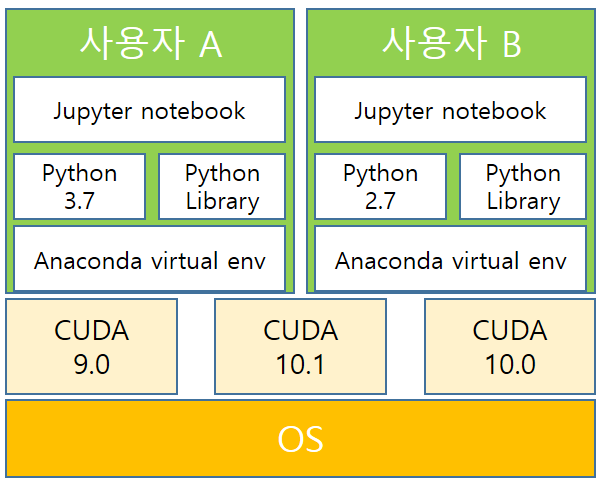

# The-fastest-joignable-Docker: 도커 공부를 위한 저장소
본 문서는 도커를 다중 사용자의 개발환경 구축을 목적으로 작성되었습니다.
추가되었으면 좋겠다 생각하시는 자료를 알려주시면 반영하도록 하겠습니다.

_본 문서는 아래와 같은 규칙을 따라 작성되었습니다._
- 최종 목적은 <U>개인 맞춤형 Cuda 버전과 파이썬 라이브러리 버전을 지원</U>하기 위함입니다.
- 범용성있는 도커 파일을 구축하는 것이 목적입니다.
- 목적에 맞는 예시와 시행착오 모두 기록합니다.
<br/>

**방향**
1. 한 서버에서 여러 사용자가 각각 다른 라이브러리를 쓸 수 있는 환경 구축
2. 새로운 사용자가 추가 되었을 때 라이브러리 설치 전까지 자동 환경설정
3. 사용자는 서버의 루트 권한을 부여하지 않아야 함
4. 서버가 추가 되었을 때 쉽게 설정 할 수 있는 확장성 고려

## 3. 계획 3

- 이전 도커를 사용하려고 했던 목적은 다음과 같습니다.
	- 방향 1: 컨테이너를 생성함으로 서버 로컬의 영향 최소화
	- 방향 2: 도커파일의 설정으로 컨테이너 생성 시 기본 설정 자동화
	- 방향 3: Jupyter notebook 인터페이스를 제공함으로써 서버 CLI 접근 최소화
	- 방향 4: 새로운 서버에 도커를 설치시 쉽게 확장 가능
- 이전 virtualenv를 사용하지 않은 이유는 R언어 및 CUDA의 여러 버전 적용 불가능하다고 판단했습니다.
- 지인분과 대화를 한 결과 서비스 배포 목적이 아닌 개발환경 도커의 적용이 불필요하다고 조언을 받고 다른 방법을 찾았습니다.
	- 방향 1: 가상환경 이용
	- 방향 2: 배치파일과 스크립트를 이용
	- 방향 3: 권한 설정 및 jupyter 인터페이스 제공
	- 방향 4: 검색 중. 배치파일 이용 예정

### 3.1 참고자료
- [anaconda 설치 및 PATH 설정](https://m.blog.naver.com/cjh226/220919371679)
- [가상환경에 여러 버전의 CUDA 추가](https://blog.kovalevskyi.com/multiple-version-of-cuda-libraries-on-the-same-machine-b9502d50ae77)

### 3.2 과정
#### 쿠다 설치 및 설정
```bash
#cuda 10.0을 추가로 설치 후 변수 설정
wget [CUDA 10.0 다운로드 주소] 
sudo sh [CUDA 10.0 다운로드 주소]
```

#### 아나콘다 설치와 환경 설정
```bash
wget [아나콘다URL]
bash -b [아나콘다 파일]
vim /etc/profile
```
`export PATH=/usr/anaconda/bin:$PATH`

```bash
source /etc/profile
```

#### 아나콘다를 위한 user 생성 설정
```bash
echo "ID 입력하세요."
read user_id
adduser --disabled-password --gecos '' $user_id
adduser $user_id sudo
echo '%sudo ALL=(ALL) NOPASSWD:ALL' >> /etc/sudoers
passwd $user_id

chmod a+rwx /home/$user_id/
```
#### user별 환경설정 후 가상환경 생성
```bash
export PATH=/home/administrator/anaconda3/bin:$PATH

echo "가상환경 이름을 입력하세요. e.g.) keras1_env"
read env_name
echo "가상환경에 사용할 파이썬 버전을 입력하세요. e.g) python 3.7이면 3.7입력"
read py_ver
conda create -n $env_name pip python=$py_ver

echo "가상환경을 시작합니다. 키는 명령어 conda activate 가상환경이름, 끄는 명령어 conda deactivate"
conda activate $env_name
```
#### 가상환경 별 쿠다 버전 적용
[가상환경에 여러 버전의 CUDA 추가](https://blog.kovalevskyi.com/multiple-version-of-cuda-libraries-on-the-same-machine-b9502d50ae77)
