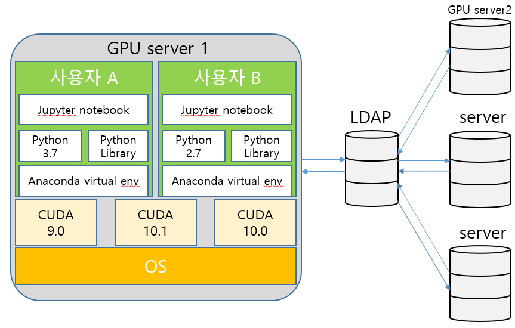

# The-fastest-joignable-Docker: 도커 공부를 위한 저장소
본 문서는 도커를 다중 사용자의 개발환경 구축을 목적으로 작성되었습니다.
추가되었으면 좋겠다 생각하시는 자료를 알려주시면 반영하도록 하겠습니다.

_본 문서는 아래와 같은 규칙을 따라 작성되었습니다._
- 최종 목적은 <U>개인 맞춤형 Cuda 버전과 파이썬 라이브러리 버전을 지원</U>하기 위함입니다.
- 범용성있는 도커 파일을 구축하는 것이 목적입니다.
- 목적에 맞는 예시와 시행착오 모두 기록합니다.
 

**방향**
1. 한 서버에서 여러 사용자가 각각 다른 라이브러리를 쓸 수 있는 환경 구축
2. 새로운 사용자가 추가 되었을 때 라이브러리 설치 전까지 자동 환경설정
3. 사용자는 서버의 루트 권한을 부여하지 않아야 함
4. 서버가 추가 되었을 때 쉽게 설정 할 수 있는 확장성 고려

## 4. 계획 4(진행 중)

- 계획 3을 바탕으로 하되 아래 조건을 추가적으로 적용시킬 예정입니다.
	- 현재 시스템은 LDAP을 이용한 중계 서버를 통하여 모든 서버의 사용자를 관리
	- 모든 사용자의 설정을 위한 config 파일 생성

### 4.1 참고자료
- [도커에서의 DNS 서버 설치](http://bit.ly/2rPLQsX)

